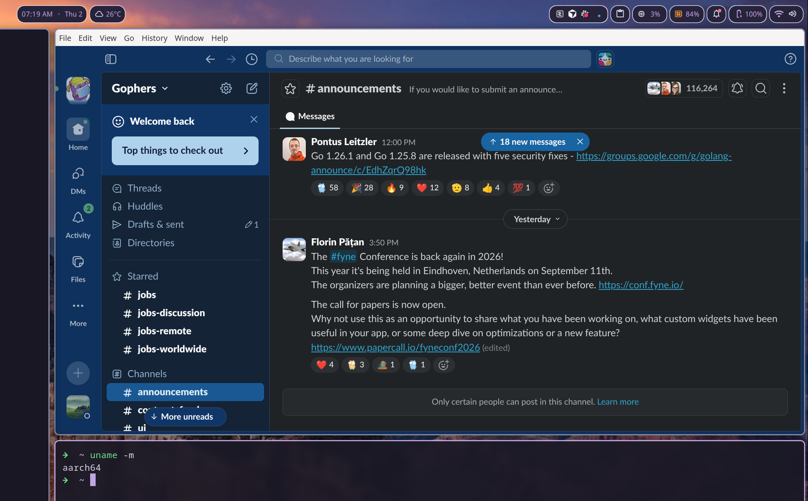

# Slack for Linux arm64/aarch64

Slack doesn't ship a Linux arm64 package. This repo repacks the official x86_64 RPM for aarch64 by swapping out all architecture-specific binaries.

Built entirely by Claude Opus 4.6.



## Available versions

| Version | Electron | Slack Desktop Utils | Source RPM |
|---------|----------|---------------------|------------|
| **4.50.143** | 42.4.1 | 1.20.0 | `slack-4.50.143-0.1.el8.x86_64.rpm` |
| 4.47.69 | 39.2.4 | 1.18.7 | `slack-4.47.69-0.1.el8.x86_64.rpm` |

## Quick start

**Standalone (no install):**
```sh
# extract 4.50.143/slack-4.50.143-arm64.tar.xz
./slack
```

**RPM install:**
```sh
sudo dnf install ./4.50.143/slack-4.50.143-0.1.el8.aarch64.rpm
slack
```

## Repository structure

Each Slack version has its own directory containing all build artifacts:

```
{VERSION}/
  asar-extracted/          # Extracted app.asar (JS app + node_modules metadata)
  native-build/            # Native module build workspace
    stubs/                 # Minimal N-API stub source + compiled .node
    workspace/             # npm workspace with package.json for buildable modules
  slack.spec               # RPM spec file for this version
  slack-{VERSION}-0.1.el8.aarch64.rpm   # Installable arm64 RPM
  slack-{VERSION}-0.1.el8.x86_64.rpm    # Original x86_64 RPM (input)
  slack-{VERSION}-arm64.tar.xz          # Standalone arm64 archive

AGENTS.md                  # Build instructions for AI agents
tools/                     # Shared build tools
```

## What gets replaced

### Electron binaries (x86_64 → arm64)

Downloaded from the matching Electron release for linux-arm64:

| File | Type |
|------|------|
| `slack` | Main Electron binary (renamed from `electron`) |
| `chrome_crashpad_handler` | Crash reporter |
| `chrome-sandbox` | Sandbox binary |
| `libEGL.so`, `libGLESv2.so` | Graphics libraries |
| `libffmpeg.so` | FFmpeg codec library |
| `libvk_swiftshader.so`, `libvulkan.so.1` | Vulkan libraries |
| `snapshot_blob.bin`, `v8_context_snapshot.bin` | V8 snapshots |
| `icudtl.dat` | ICU data |
| `resources.pak`, `chrome_*_percent.pak` | Chromium resources |
| `vk_swiftshader_icd.json` | Vulkan ICD config |
| `locales/*.pak` | All locale files |

### Native Node modules (x86_64 → arm64)

| Module | Source |
|--------|--------|
| `keymapping.node` | Built from npm [`native-keymap`](https://www.npmjs.com/package/native-keymap) (public fork of `@tinyspeck/native-keymap`) |
| `slackdesktoputils.node` | arm64 prebuild from `slack-desktop-native-prebuilds.s3.amazonaws.com` |
| `electron_native_auth.node` | Built from npm [`electron-native-auth`](https://www.npmjs.com/package/electron-native-auth) |
| `file_handler_info.node` | Built from npm [`file-handler-info`](https://www.npmjs.com/package/file-handler-info) |
| `cf-prefs.node` | Minimal arm64 N-API stub (macOS-only, no-op on Linux) |
| `registry.node` | Minimal arm64 N-API stub (Windows-only, no-op on Linux) |
| `focusassist.node` | Minimal arm64 N-API stub (Windows-only, no-op on Linux) |
| `notificationstate.node` | Minimal arm64 N-API stub (macOS-only, no-op on Linux) |

### Scripts modified

- `etc/cron.daily/slack` — `DEFAULT_ARCH` set to `aarch64`, `REPOCONFIG` disabled (Slack has no arm64 repo on packagecloud), `get_lib_dir()` updated to handle `aarch64`

### Removed

- `usr/lib/.build-id/` — stale x86_64 build IDs

### Untouched

- `app.asar` — the entire JS application
- All sound files, icons, desktop entry, metainfo, symlinks
